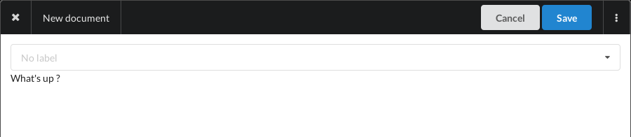

+++
title = "Blank document"
weight = 1
+++

To create a new document from scratch, you can:

- Click on the `+` button, then choose `Empty`
- Press `shift+n`
- Or go to [documents/create](https://app.nunux.org/keeper/documents/create)

{}
BTW, press any time `?` to see available keyboard shortcuts
{}

The document edition page will open:

On this page, you can:

- Edit title: click on menu button the choose `Edit title`
- Add labels: click on the drop-down list of labels
- Edit content: click on the document body to activate the WYSIWYG editor.

Click on the `Save` button and the document will be saved.
