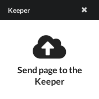
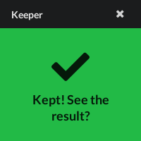

+++
title = "Use the Bookmarklet"
description = ""
weight = 3
+++

A bookmarklet is a tiny application stored as a bookmark in the web browser.
It allows the user to interact with the current page.

In the case of Nunux Keeper, the bookmarklet allows you to save all or part of
the page.

You can find the bookmarklet in the first tab of the `settings` page.
The installation is simple.
You just have to drag and drop the `Keep This!` button into your browser's
bookmarks bar.

Now you can, at any time while browsing any web site, click on this bookmark
and trigger the bookmarklet.

The bookmarklet allows the following actions:

- **Save the page.**
  Click on it.
- **Save a part.**
  Select with the mouse the part of the page you are interested in and drag the
  selection to the bookmarklet. Click on it.
- **Save an image.**
  Drag and drop the image you are interested in onto the bookmaklet and click on
  it.

Once the document has been created, you can click on the bookmarklet again to
see the result.

{}
If you are not logged in, the bookmaklet will display a padlock with the
following message: `Please login first`.
Click on it, it will redirect you to the login page before returning to the
target page.
{}

