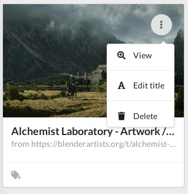
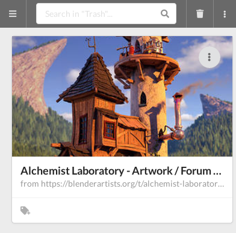

+++
title = "Delete a document"
weight = 5
+++

To delete a document, click on its context menu and choose `Delete`.

The document is not deleted immediately, but it is moved to the recycle bin.
A document that is in the recycle bin no longer appears in the search and sharing.

A scheduled task permanently deletes the documents from the recycle bin after a
delay configured by the administrator.

However, you can empty the recycle bin.
In this case all documents present in it will be deleted as well as their
attachments.
This action is definitive.

You can also restore a document that is in the recycle bin.

