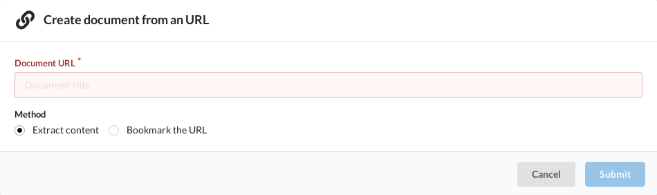

+++
title = "Import a web page"
description = ""
weight = 2
+++

To create a new document from a web page, you can:

- Click on the `+` button then choose `From URL`
- Press `shift+u`
- Or directly by adding the targeted URL to this URL:
  [document/create?url=MA_PAGE](https://app.nunux.org/keeper/documents/create?url=)

The first two actions will open a page to enter the target URL:

You have two options:

- Extract the content of the targeted page
- Or take a screenshot

In the first case, the page will be downloaded, cleaned of its unwanted content,
and all images will also be saved.

In the second case, a full capture of the page will be made.
The resulting image will be the body of the document.

