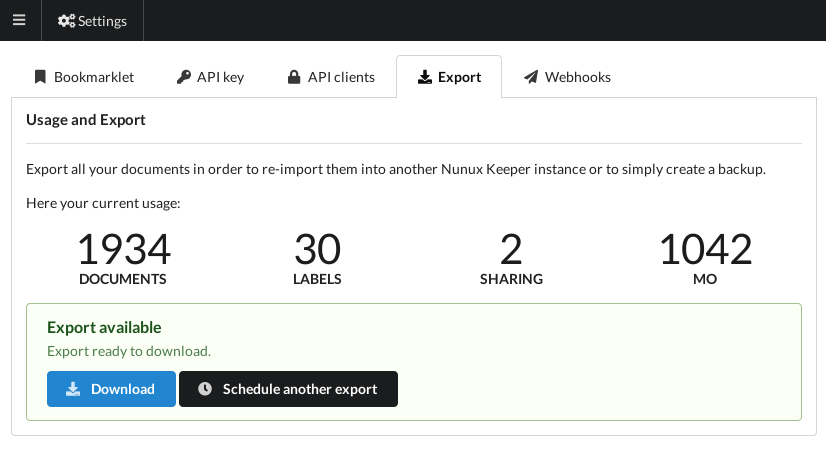

+++
title = "Export your data"
description = "How to keep control of your data"
weight = 4
+++

Documents you create are yours.
Therefore you can export all your data (texts, labels and images) from the
settings screen:

To request an export, click on the export schedule button.
Depending on the server load and the number of documents, this processing can
take a while.

Once finished, you have the possibility to download the export archive.

This archive contains all your documents.
The format is simple and reusable for other needs than import.

{}
However, the import is a manual procedure.
For the moment, only the administrator is authorized to import an archive.
{}
