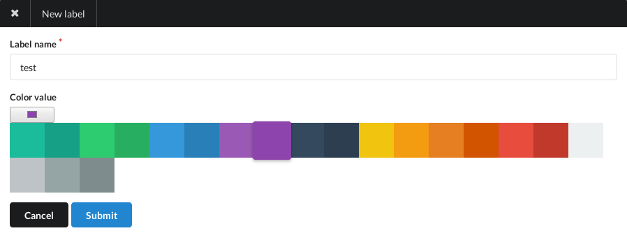
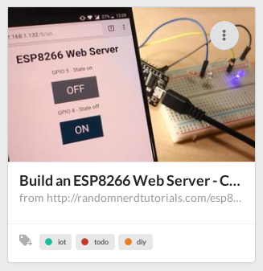

+++
title = "Organizing and Searching"
description = ""
weight = 2
+++

To organize your documents, you can assign labels to them.

### Labels

A label is similar to a colored tag.

To create a new label, you can:

- Click on the `Create new Label` link in the left side menu
- Or go to [labels/create](https://app.nunux.org/keeper/lables/create)

The label editing page will open:

On this page you can:

- Give a name to your label
- Set a color

Press the `Submit` button to create the label.

Once created, you can assign this label to your documents.
To do this, simply click on the drop-down list of labels for your documents.
The documents will then be grouped by label and you will be able to navigate
between the labels by clicking on them.

### Search

Another way to find your documents is through the search engine.
It's a very powerful "full text" search engine powered by ElasticSearch.

You can type your keywords or special keywords to refine your search.

Examples of research:

- Search for documents containing `amazon` OR `alexa`:
  `amazon alexa` or `amazon OR alexa`
- Search for documents containing `amazon` AND `alexa`:
  `amazon +alexa` or `amazon AND alexa`
- Search for documents containing `amazon` WITHOUT `alexa`:
  `amazon -alexa` or `amazon AND NOT alexa`
- Search for documents with `alexa` in the title:
  `title: alexa`
- Search for documents without a label:
  `NOT _exists_: labels`
- ...

You can find the complete documentation of this syntax [here][query-dsl].

[query-dsl]: https://www.elastic.co/guide/en/elasticsearch/reference/current/query-dsl-query-string-query.html
