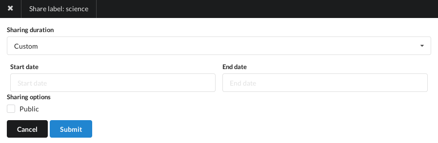
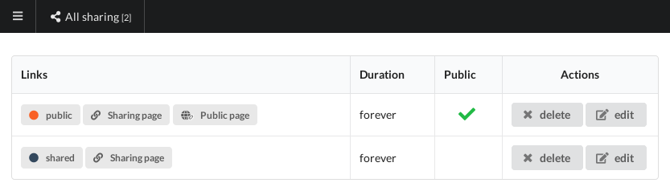

+++
title = "Share"
description = "How to share your documents with other users or in a public way"
weight = 3
+++

In Nunux Keeper the notion of sharing concerns a label.
In other words, all documents with a shared label are shared.

### Share a label

To share a label, you can:

- Click on the context menu of a label page and chose `Share label`
- Or go to [/label/ID/share](https://app.nunux.org/keeper/labels/ID/share)

The edit page of a share will open:

You can do it here:

- Define the duration of the sharing with possibly a time interval
- Specify the type of sharing (public or not)

A sharing can be time-bound or not.
Its start date can also be in the future.

A public sharing will be accessible without the need to be authenticated.
This is a dedicated page that allows you to consult the documents freely.

{}
This page also provides an RSS feed at the following address:
https://api.nunux.org/keeper/v2/public/[PAGE_ID]?output=rss
{}

A non-public sharing is a page that can only be viewed by a connected user.

In both cases, you must provide the URL to give access to a third party.

### Manage shares

To manage the shares, you can:

- Click on the `Sharing` link in the left side menu
- Press `g+r`
- Or got to [/sharing](https://app.nunux.org/keeper/lables/create)

The share management page will open:

On this page, you can:

- Modify an existing share
- Delete it

