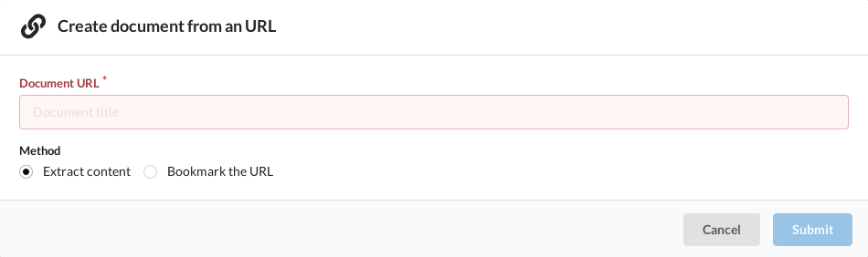

+++
title = "Importer une page Web"
description = ""
weight = 2
+++

Pour créer un nouveau document depuis une page Web, vous pouvez:

- Cliquer sur le bouton `+` puis `From URL`
- Appuyer sur la combinaison de touche: `shift+u`
- Ou directement en précisant l'URL de la page dans l'URL
  [document/create?url=MA_PAGE](https://app.nunux.org/keeper/documents/create?url=)

Les deux premières actions vont ouvrir une page de saisie de l'URL cible:

Deux options se présentent à vous:

- Extraire le contenu de la page cible
- Ou effectuer une capture d'écran

Dans le premier cas, la page sera téléchargée, nettoyée de son contenu
indésirable, et toutes les images référencées seront également sauvegardées.

Dans le second cas, une capture intégrale de la page sera faite. L'image
résultante sera le corps du document.

